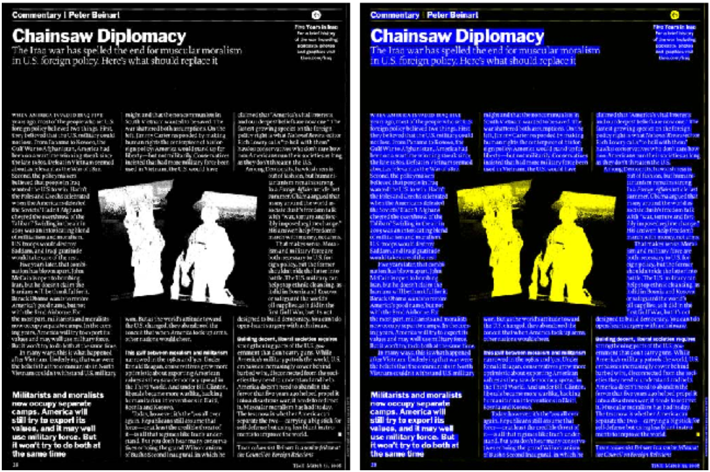

## Frank Julca-Aguilar

I am a Senior Computer Vision Researcher at <a href="https://algolux.com"> Algolux</a>. I received my PhD from <a href="https://www5.usp.br"> University of Sao Paulo </a> and <a href="https://english.univ-nantes.fr">  University of Nantes </a>. I study and build robust and scalable Machine Learning Methods for Computer Vision. My work lies at the intersection of Machine Learning, Image Processing, and Computer Vision.

## Publications
Recent publications (for a complete list of publications see <a href="https://scholar.google.com/citations?user=jepjJjcAAAAJ&hl=en:"> GoogleScholar</a>): 
<table>
<!-- <thead>
<tr>
<th> </th>
<th> <a href="https://light.princeton.edu/publication/dirty-pixels/">Dirty pixels: Towards end-to-end image processing and perception.</a>  
Steven Diamond*, Vincent Sitzmann*, Frank Julca-Aguilar*, Stephen Boyd, GordonWetzstein, and Felix
Heide. (*Joint first authorship). ACM Transactions on Graphics (TOG), presented at SIGGRAPH, 2021.  </th>
</tr>
</thead> -->
<tbody>
<tr>
<td></td>
<td style="vertical-align:top"> <a href="https://light.princeton.edu/publication/gated3d/"> Gated2gated: Self-supervised depth estimation from gated images.</a> Amanpreet Walia, Stefanie Walz, Mario Bijelic, Fahim Mannan, Frank Julca-Aguilar, Michael Langer,
Werner Ritter, and Felix Heide.  IEEE Computer Vision and Pattern Recognition Conference (CVPR), 2022.</td>
</tr>

<tr>
<td></td>
<td style="vertical-align:top">  <a href="https://light.princeton.edu/publication/dirty-pixels/">Dirty pixels: Towards end-to-end image processing and perception.</a>  
Steven Diamond*, Vincent Sitzmann*, Frank Julca-Aguilar*, Stephen Boyd, GordonWetzstein, and Felix
Heide. (*Joint first authorship). ACM Transactions on Graphics (TOG), presented at SIGGRAPH, 2021.</td>
</tr>
<tr>
<td></td>
<td style="vertical-align:top"> <a href="https://light.princeton.edu/publication/gated3d/"> Gated3D: Monocular 3D object detection from temporal illumination cues.</a> Frank Julca-Aguilar, Jason Taylor, Mario Bijelic, Fahim Mannan, Ethan Tseng, and Felix Heide. IEEE International Conference on Computer Vision (ICCV), 2021.</td>
</tr>
<tr>
<td></td>
<td style="vertical-align:top"> <a href="http://www.cs.princeton.edu/~fheide/gated2depth"> Gated2depth: Real-time dense lidar from gated images.</a> Tobias Gruber, Frank Julca-Aguilar, Mario Bijelic, and Felix Heide. IEEE International Conference on Computer Vision (ICCV), 2019.</td>
</tr>
<tr>
<td></td>
<td style="vertical-align:top"> <a href="https://arxiv.org/abs/1709.06476"> Image operator learning coupled with CNN classification and its application to staff line removal.</a> Frank Julca-Aguilar and Nina Hirata. IAPR International Conference on Document Analysis and Recognition (ICDAR), 2017.</td>
</tr>
<tr>
<td></td>
<td style="vertical-align:top"> <a href="https://ieeexplore.ieee.org/document/8097346">  Text/non-text classification of connected components in document images.</a> Frank Julca-Aguilar, Ana Maia, and Nina Hirata. In 30th Conference on Graphics, Patterns, and Images (SIBGRAPI), 2017.</td>
</tr>
<tr>
<td></td>
<td style="vertical-align:top"> <a href="http://arxiv.org/abs/1712.04833"> Symbol detection in online handwritten graphics using Faster R-CNN.</a> Frank D. Julca-Aguilar and Nina S. T. Hirata. In 13th IAPR International Workshop on Document Analysis Systems (DAS), 2018.</td>
</tr>
<tr>
<td></td>
<td style="vertical-align:top"> <a href="http://ieeexplore.ieee.org/document/7900167/"> Subexpression and
dominant symbol histograms for spatial relation classification in mathematical expressions.</a> Frank Julca-Aguilar, Nina Hirata, Harold Mouchère, and Christian Viard-Gaudin. In 23rd
International Conference on Pattern Recognition (ICPR), 2016.
</td>
</tr>

<tr>
<td></td>
<td style="vertical-align:top"> <a href="https://arxiv.org/abs/1709.06389"> A general framework for the recognition of online handwritten graphics.</a> Frank Julca-Aguilar and Nina Hirata. International Journal on Document Analysis and Recognition (IJDAR), 2020.
</td>
</tr>
<tr>
<td></td>
<td style="vertical-align:top"> <a href="http://ieeexplore.ieee.org/document/6195354/"> Expressmatch: A system for creating ground-truthed datasets of online mathematical expressions.</a> Frank D. Julca-Aguilar and Nina S. T. Hirata. In Proceedings of the 10th IAPR International Workshop on Document Analysis Systems (DAS), 2012.
</td>
</tr>
<tr>
<td></td>
<td style="vertical-align:top"> <a href="http://www.sciencedirect.com/science/article/pii/S0031320314003768"> Matching based ground-truth annotation for online handwritten mathematical expressions. </a>  Nina S.T. Hirata and Frank D. Julca-Aguilar. Pattern Recognition (PR), 2015.
</td>
</tr>

</tbody>
</table>

